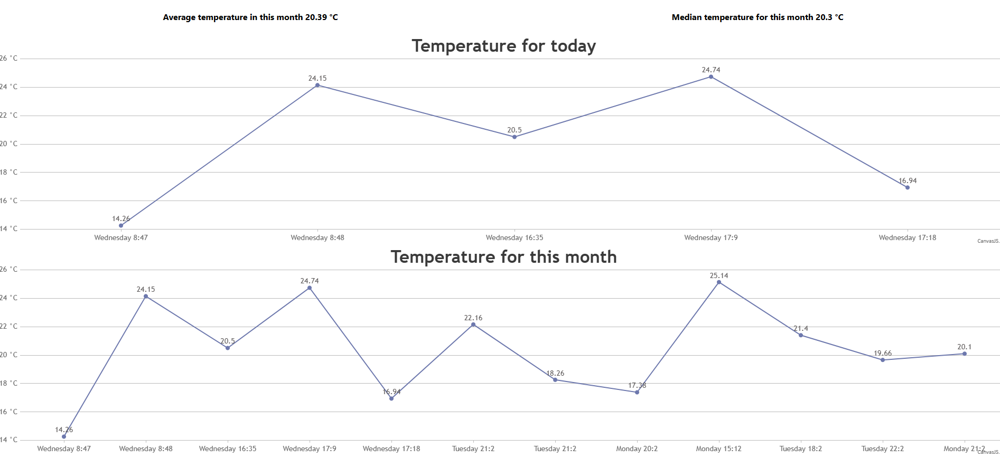

<h4>DS18B20Temperature</h4>

----

	DS18B20Temperature - react приложение, которое отображает данные о температуре. DS18B20 собирает информацию, далее wemos d1 mini создает post http запрос на express api, данные записываются в mysql базу данных.

<figure>
  <figcaption>Компоненты требуемые для сбора и передачи данных:</figcaption>
	<ul> 
		<li>esp8266 Wemos d1 mini - для коммуникации между ds18b20 и express api эндпоинтами.</li>
		<li>DS18B20 - для сбора информации о температуре.</li>
		<li>Wemos Battery Shield - для подачи питания с помощью литиевой батарейки.</li>
		<li>Li-Pol battery 3,7v 1A - для хранения и подачи питания.</li>
		<li>Резистор 5,1 - 4,7 кОМ - для ограничения силы тока, припаять резистор между шиной данных и анодом.</li>
	</ul>
</figure>

Шина данных ds18b20 должна быть соединена с пином D4 на esp8266. После сборки компонентов требуется загрузить [скетч](./sketches/esp8266.ino) на wemos d1 mini, перед загрузкой нужно изменить приватный ip переменной SERVER_IP. esp8266 и сервер express api должны находиться в одной сети для взаимодействия друг с другом.

Пример результата:

