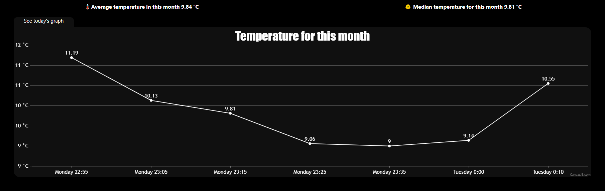

<h3>DS18B20Temperature</h4>

----

	DS18B20Temperature - react приложение, которое отображает данные о температуре. DS18B20 собирает информацию, далее wemos d1 mini создает post http запрос на express api, данные записываются в mysql базу данных.

<figure>
  <figcaption>Компоненты требуемые для сбора и передачи данных:</figcaption>
	<ul> 
		<li>Esp8266 Wemos d1 mini - для коммуникации между ds18b20 и express api эндпоинтами.</li>
		<li>DS18B20 - для получения значения текущей температуры.</li>
		<li>Диод 1N5819 Шоттки - для ограничения подачи электричества при зарядке и использовании esp.</li>
		<li>Понижающий DC-DC  LM2596S преобразователь на 3,3 вольта - для преобразования напряжения с 3,7 вольт до 3,3.</li>
		<li>Модуль заряда аккумуляторов TP4056 - для альтернативной подачи питания и зарядки литийного аккумулятора</li>
		<li>Li-Pol battery 3,7v 1A - для хранения и подачи питания.</li>
		<li>Резистор 5,1 - 4,7 кОМ - для ограничения силы тока, припаять резистор между шиной данных и анодом.</li>
		<li>Переключатель клавишный / Тумблер - для прерывания/восстановления цепи (включения/выключения)</li>
	</ul>
</figure>

Шина данных ds18b20 должна быть соединена с пином D4 на esp8266. После сборки компонентов требуется загрузить [скетч](./sketches/esp8266.ino) на wemos d1 mini, перед загрузкой нужно изменить приватный ip переменной SERVER_IP (стандартное значение для порта express api 3210), также требуется изменить STASSID и STAPSK переменные под вашу wifi сеть. esp8266 и сервер express api должны находиться в одной сети для взаимодействия друг с другом.

Пример результата:

<b>Комманда для запуска проекта: npm start в корневой папке проекта</b>

<b>Библиотека nodemon не работает для express, как включить nodemon для разработки см. [package.json](./server/package.json) в COMMENT_SECTION</b>